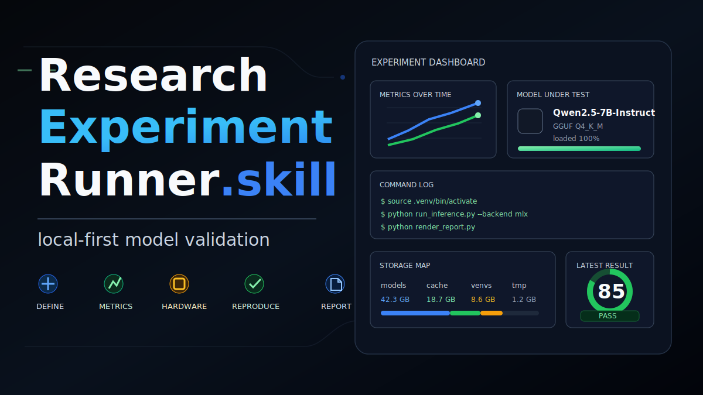
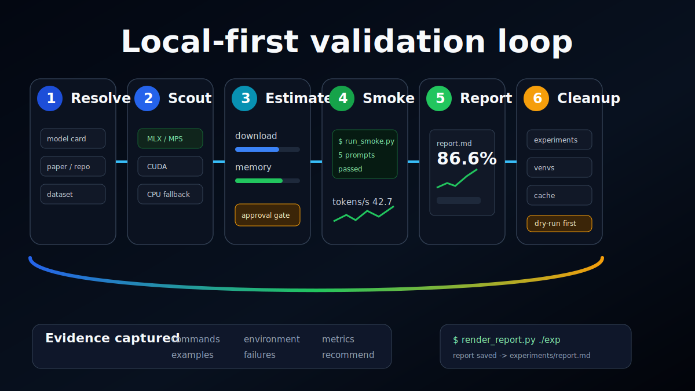

<div align="right">

**[English](README_EN.md)** | 中文

</div>



<div align="center">

# Fast Research Experiment Runner.skill

**把新模型测试变成一次可复现、可度量、可清理的小实验。**

一个给 Codex 用的 local-first 实验 skill：快速验证 Hugging Face 模型、GGUF / 本地 LLM、论文 claim、训练配方、prompt、视觉/多模态系统，不再让模型文件、虚拟环境、缓存和日志散落在电脑各处。

它回答一个每天都会遇到的问题：

**「这个新模型我的机器能不能跑？跑起来以后值不值得留下？」**

[](LICENSE)
[](https://skills.sh)
[](#local-first-by-default)
[](#storage--cleanup)

```bash
npx skills add allus-ai/fast-research-experiment-runner-skill
```

</div>

---

> [!NOTE]
> **这不是 benchmark 大而全套件。**
> 它是一个快速验证闭环：先确认目标，再侦察硬件加速，估算下载和清理成本，跑小样本 smoke test，保存证据，最后给出保留、继续调查或删除的建议。

---

## What's New

这版 README 参考了 [`alchaincyf/darwin-skill`](https://github.com/alchaincyf/darwin-skill) 的 GitHub 主页结构，但视觉和叙事改成了模型实验场景：

- 顶部改成强视觉 banner，第一眼就知道这是「本地模型实验控制台」
- 用一张完整 pipeline 图替代纯 Mermaid，让核心循环更像产品说明
- 把「是否值得留下」拆成运行、速度、质量、清理成本四类证据
- 强化 local-first、primary-source-first、cleanup-ready 三条主线
- README 主语言改为中文，并保留英文版入口

---

## Core Loop



每次实验都围绕四个问题收敛：

| 问题 | 需要留下的证据 |
|:---|:---|
| 这台机器能不能跑？ | hardware profile、backend 选择、模型加载结果 |
| 速度和资源占用是否可接受？ | latency、tokens/sec、显存/内存、运行时间 |
| 输出质量是否过基本线？ | prompts / samples、metrics、失败案例 |
| 能不能干净删除？ | artifact map、dry-run cleanup、可回收空间估算 |

---

## Why

新模型发布速度太快了。最容易发生的事情是：复制一段安装命令，下载一个大 checkpoint，跑一个 prompt，然后忘记装了什么、文件在哪里、缓存占了多少空间。

这会带来三个问题：

1. 结果不可复现：不知道模型 revision、依赖版本、硬件路径和命令。
2. 成本不可见：下载、venv、cache、临时文件慢慢堆满磁盘。
3. 判断不可靠：模型「能启动」被误认为「值得留下」。

Fast Research Experiment Runner 把每一次试模型都压缩成一个小实验包：小样本先跑，证据完整记录，报告可读，最后能一键预览清理。

---

## From Autoresearch To Model Experiments

这个 skill 借鉴了 autoresearch 和 skill optimization 系统里的实验闭环思想：目标明确、边界清楚、先验证再放大，只保留有证据支撑的结论。

| 研究闭环思想 | 在本 skill 中的对应 |
|:---|:---|
| 定义 claim | 把模型、论文或方法要验证的主张写成一句话 |
| 选择验证集 | 先用最小 prompt 集或 tiny dataset slice |
| 先跑再扩 | 先加载模型并跑 1-5 个 smoke examples |
| 记录所有动作 | 保存命令、环境、metrics、examples、failures |
| 作出结论 | adopt / investigate further / reject |
| 恢复干净状态 | venv、downloads、cache、tmp 都有清理路径 |

---

## Five Principles

| # | 原则 | 含义 |
|:---|:---|:---|
| 01 | **Local first** | 默认在当前机器验证；远程或付费 compute 必须显式确认 |
| 02 | **Small before expensive** | 大下载、长 benchmark、native build、driver/toolchain 前先 smoke test |
| 03 | **Primary sources first** | 优先查 model card、paper、repo、dataset card、runtime 官方文档 |
| 04 | **Evidence over vibes** | 不凭感觉评价模型，必须留下 metrics、examples、failures 和命令 |
| 05 | **Cleanup is part of the experiment** | 清理不是善后，而是实验设计的一部分 |

---

## Local First By Default

所有实验状态默认放在：

```text
~/.codex/research-experiment-runner/
```

默认结构：

```text
experiments/   reports, configs, logs, metrics
venvs/         one virtualenv per experiment
cache/         pip, Hugging Face, datasets, torch, npm
downloads/     explicit model/runtime downloads
tmp/           temporary files
```

实验依赖不全局安装。安装依赖或运行下载前，先进入实验环境：

```bash
source <experiment-dir>/env.sh
```

---

## Workflow

1. **确认目标**
   解析 exact model ID、paper、repo、dataset、revision、license 和一句话 claim。

2. **硬件加速侦察**
   先生成 `hardware.json`，再根据当前硬件和任务查官方/一手文档，写下 `acceleration.md`。

3. **成本估算**
   记录预计下载大小、venv 大小、cache 成本、显存/内存压力、清理命令。

4. **Smoke test**
   加载模型或方法，跑 1-5 个有超时限制的小样本。

5. **Quick validation**
   用 tiny benchmark slice、固定 seed、可行时加 baseline。

6. **Demo if useful**
   默认 Gradio；只有产品式交互或复杂可视化需要时才做 web demo。

7. **Report**
   汇总 objective、setup、acceleration decision、commands、metrics、examples、failures、limitations 和 recommendation。

8. **Cleanup**
   先 dry-run 预览，再删除指定 artifacts。

---

## Quick Start

安装：

```bash
npx skills add allus-ai/fast-research-experiment-runner-skill
```

或者手动复制：

```bash
mkdir -p ~/.codex/skills
cp -R research-experiment-runner ~/.codex/skills/
```

让 Codex 测一个新模型：

```text
Use $research-experiment-runner to test the latest 4B Qwen model locally.
```

验证论文核心 claim：

```text
Use $research-experiment-runner to reproduce the core claim of this segmentation paper on a tiny local sample set.
```

清理旧实验：

```text
Use $research-experiment-runner to clean old experiments and model caches, but keep the reports.
```

---

## Storage & Cleanup

先预览：

```bash
python3 ~/.codex/skills/research-experiment-runner/scripts/cleanup.py --dry-run --all --include-cache
```

确认后删除：

```bash
python3 ~/.codex/skills/research-experiment-runner/scripts/cleanup.py --all --include-cache
```

清理脚本会打印将要删除的路径和预计可回收空间。

---

## Safety Rules

- 不经显式确认，不启动长时间训练、大下载、付费云计算、driver 安装或 native toolchain build。
- 不全局安装实验依赖。
- 不把实验 artifacts 写到 `~/.codex/research-experiment-runner/` 之外，除非用户明确要求。
- 不把「demo 能跑」当作「实验成功」。
- 不隐藏失败尝试。
- 不保留多 MB 的失败 stdout 日志；只保存小片段并删除超大文件。
- 不因为模型能启动就声称它适合本地使用。

---

## Test Prompts

包内包含 `research-experiment-runner/test-prompts.json`，覆盖：

- Hugging Face text-generation model validation
- image segmentation paper tiny reproduction
- old experiment and model cache cleanup
- hardware-specific acceleration selection
- local 12B model feasibility check
- cleanup while preserving the final conclusion

---

## Design Notes

这个项目的设计目标是让「试模型」从随手一跑变成可追踪的小实验：

- `SKILL.md` 负责触发条件、流程和操作边界
- `test-prompts.json` 负责回归测试和行为样例
- `references/` 负责实验协议、任务 playbook、demo、存储清理和加速侦察
- `scripts/` 负责 scaffold、hardware profile、env capture、report render 和 cleanup

它也适合和 [`darwin-skill`](https://github.com/alchaincyf/darwin-skill) 配合：先用真实模型实验积累 friction，再用 Darwin 类工具根据证据优化 skill。

---

## Credits

视觉和 README 页面节奏参考了 [`alchaincyf/darwin-skill`](https://github.com/alchaincyf/darwin-skill)：强首屏图、清晰定位、可视化核心循环、原则表和操作边界。本文案和图片重新面向「本地模型实验验证」场景设计。

---

## License

MIT

---

<div align="center">

**快试模型。留下证据。干净删除。**

MIT License © [allus-ai](https://github.com/allus-ai)

</div>
