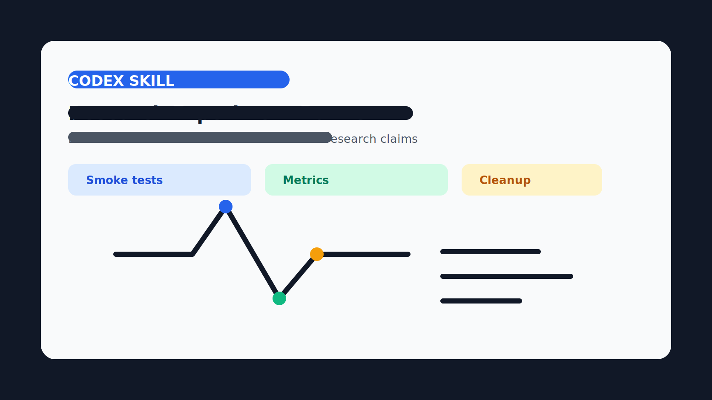

# Research Experiment Runner Skill



A Codex skill for trying new AI models locally without filling your laptop with forgotten model files, virtual environments, and caches.

It is designed for the everyday workflow of "a new model just came out; can my machine run it, and is it worth keeping?"

## What This Skill Does

- Resolves the exact model ID before downloading.
- Checks your hardware before picking an acceleration library.
- Searches current official or primary docs for the best local runtime.
- Keeps every experiment under one cleanup-friendly folder.
- Runs small smoke tests before expensive work.
- Records commands, environment, metrics, failures, and recommendation.
- Builds a local demo when useful.
- Cleans model downloads, venvs, caches, and temp files safely.

## Why It Exists

New models appear every day. It is tempting to install random packages, download huge checkpoints, run one command, and then forget where the files went.

This skill makes each model test answer four practical questions:

1. Does it run on my hardware?
2. Is it fast enough to keep?
3. Did it pass basic prompts?
4. Can I delete everything cleanly afterward?

## Install

Copy the skill folder into your local skills directory:

```bash
mkdir -p ~/.codex/skills
cp -R research-experiment-runner ~/.codex/skills/
```

Restart Codex if the skill does not appear immediately.

## Quick Start

Ask Codex:

```text
Use $research-experiment-runner to test the latest 4B Qwen model locally.
```

The skill will:

1. Create an experiment folder.
2. Capture your hardware profile.
3. Search current model/runtime docs.
4. Estimate download size and cleanup cost.
5. Ask before large downloads or native builds.
6. Run a bounded smoke test.
7. Produce a report.

## Storage

Everything goes under:

```text
~/.codex/research-experiment-runner/
```

Default layout:

```text
experiments/   reports, configs, logs, metrics
venvs/         one virtualenv per experiment
cache/         pip, Hugging Face, datasets, torch, npm
downloads/     explicit model/runtime downloads
tmp/           temporary files
```

## Cleanup

Always preview first:

```bash
python3 ~/.codex/skills/research-experiment-runner/scripts/cleanup.py --dry-run --all --include-cache
```

Delete after review:

```bash
python3 ~/.codex/skills/research-experiment-runner/scripts/cleanup.py --all --include-cache
```

The cleanup script prints exactly what it will remove and how much space it expects to reclaim.

## Design Notes

This package follows the common pattern used by high-quality skills:

- short `SKILL.md` with trigger and workflow
- focused `references/` for details
- small stdlib-first scripts
- cleanup and failure handling as first-class behavior

## License

MIT
