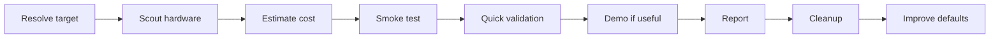

<div align="right">

English

</div>


<div align="center">

# Research Experiment Runner.skill

**Test new AI models like a small, reproducible research experiment.**

A Codex skill for quickly validating Hugging Face models, GGUF/local LLMs, research claims, training recipes, prompts, and multimodal systems without scattering downloads, virtualenvs, logs, and caches across your laptop.

It is built for the everyday question: **"A new model just came out. Can my machine run it, and is it worth keeping?"**

[](LICENSE)
[](https://skills.sh)
[](#local-first-by-default)
[](#storage--cleanup)

```bash
npx skills add allus-ai/fast-research-experiment-runner-skill
```

</div>

---

> [!NOTE]
> This skill is not a benchmark suite. It is a fast validation loop: resolve the exact target, choose the smallest useful test, scout hardware acceleration, run a bounded smoke test, capture evidence, and clean up safely.

---

## What It Does

Most model tests fail in boring ways: the wrong model ID, a bad runtime choice, an accidental 40GB download, an untracked virtualenv, or a demo that works once but leaves no report.

Research Experiment Runner turns each trial into a compact experiment package:

- resolves exact model, paper, repo, dataset, and revision IDs before download
- checks hardware before choosing PyTorch, MLX, llama.cpp, ONNX Runtime, OpenVINO, or CPU fallback
- estimates download size, memory pressure, venv size, and cleanup cost before expensive work
- runs smoke tests before full evaluation
- captures commands, environment, metrics, qualitative examples, failures, and recommendations
- builds a local Gradio or web demo only when useful
- keeps artifacts under one managed root with a dry-run cleanup path

---

## Core Loop



Each run answers four practical questions:

| Question | Evidence captured |
|:---|:---|
| Does it run on this machine? | hardware profile, backend choice, load result |
| Is it fast enough to keep? | latency, tokens/sec, memory, runtime notes |
| Does it pass basic prompts or samples? | examples, metrics, failures |
| Can it be deleted cleanly? | artifact map, dry-run cleanup, reclaim estimate |

---

## Why This Exists

New AI models appear constantly. The tempting path is to copy a snippet, install a random stack, download a checkpoint, run one prompt, and forget what changed.

That creates three problems:

1. The result is not reproducible.
2. The machine fills with hidden caches and abandoned environments.
3. A model that merely starts gets mistaken for a model worth using.

This skill makes local AI experimentation boring in the right way: small first, measured, documented, and reversible.

---

## From Autoresearch To Local Model Validation

The project takes inspiration from the same research-loop mindset behind autoresearch and skill optimization systems: keep the objective explicit, run bounded experiments, preserve evidence, and only scale after validation.

| Research loop idea | This skill |
|:---|:---|
| Define the claim | Write the model, paper, or method claim in one sentence |
| Choose a validation set | Pick the smallest useful prompt set or dataset slice |
| Run before scaling | Load the model and run 1-5 smoke examples first |
| Track every command | Save setup, execution, metrics, logs, and failures |
| Keep or reject | Recommend adopt, investigate further, or reject |
| Clean state | Remove venvs, downloads, caches, and temp files safely |

---

## Five Principles

| # | Principle | Meaning |
|:---|:---|:---|
| 01 | **Local first** | Default to the current machine and only move to remote or paid compute with explicit approval |
| 02 | **Small before expensive** | Smoke test before large downloads, full benchmarks, native builds, or long runs |
| 03 | **Primary sources first** | Prefer official model cards, papers, repos, dataset cards, and runtime docs |
| 04 | **Evidence over vibes** | Record metrics, examples, failures, environment, and exact commands |
| 05 | **Cleanup is part of the experiment** | Every run must have an artifact map and dry-run cleanup path |

---

## Local First By Default

All experiment state lives under:

```text
~/.codex/research-experiment-runner/
```

Default layout:

```text
experiments/   reports, configs, logs, metrics
venvs/         one virtualenv per experiment
cache/         pip, Hugging Face, datasets, torch, npm
downloads/     explicit model/runtime downloads
tmp/           temporary files
```

The skill avoids global dependency installs. Before installing or running anything, it sources the experiment environment:

```bash
source <experiment-dir>/env.sh
```

---

## Quick Start

Install:

```bash
npx skills add allus-ai/fast-research-experiment-runner-skill
```

Or copy the skill folder manually:

```bash
mkdir -p ~/.codex/skills
cp -R research-experiment-runner ~/.codex/skills/
```

Ask Codex:

```text
Use $research-experiment-runner to test the latest 4B Qwen model locally.
```

For a research paper:

```text
Use $research-experiment-runner to reproduce the core claim of this segmentation paper on a tiny local sample set.
```

For disk cleanup:

```text
Use $research-experiment-runner to clean old experiments and model caches, but keep the reports.
```

---

## Workflow

1. **Clarify the target**
   Resolve the exact model ID, paper, repo, dataset, revision, license, and main claim.

2. **Scout acceleration**
   Capture hardware, inspect current primary docs, choose the runtime, and write `acceleration.md` before installation.

3. **Estimate cost**
   Record expected download size, venv size, memory pressure, runtime risk, and cleanup command.

4. **Run a smoke test**
   Load the model or method and run 1-5 bounded examples with timeouts.

5. **Run quick validation**
   Use tiny benchmark slices, deterministic seeds where supported, and at least one baseline when feasible.

6. **Build a demo if useful**
   Prefer Gradio for inference and qualitative review. Use a web demo only when richer interaction matters.

7. **Produce the report**
   Include objective, setup, acceleration decision, commands, metrics, examples, failures, limitations, and recommendation.

8. **Clean up safely**
   Preview deletions first, then remove only the intended artifacts.

---

## Storage & Cleanup

Always preview first:

```bash
python3 ~/.codex/skills/research-experiment-runner/scripts/cleanup.py --dry-run --all --include-cache
```

Delete after review:

```bash
python3 ~/.codex/skills/research-experiment-runner/scripts/cleanup.py --all --include-cache
```

The cleanup script prints what it will remove and how much space it expects to reclaim.

---

## Safety Rules

- Do not start long-running training, large downloads, paid cloud work, driver installs, or native toolchain builds without explicit approval.
- Do not install experiment dependencies globally.
- Do not write experiment artifacts outside `~/.codex/research-experiment-runner/` unless requested.
- Do not treat a successful demo as a successful experiment.
- Do not hide failed attempts.
- Do not keep multi-megabyte failed stdout logs; save a small excerpt and delete the oversized file.
- Do not claim a model is good for local use just because it starts.

---

## Test Prompts

The package includes `research-experiment-runner/test-prompts.json` with scenarios for:

- Hugging Face text-generation model validation
- image segmentation paper reproduction on tiny samples
- old experiment and model cache cleanup
- hardware-specific acceleration selection
- local 12B model feasibility checks
- cleanup while preserving the final conclusion

---

## Design Notes

This package follows the common Agent Skill shape:

- a concise `SKILL.md` with trigger, workflow, and operating rules
- test prompts for regression and evaluation
- local-first storage conventions
- explicit cleanup and failure handling
- primary-source-driven runtime decisions

It is meant to pair well with skill optimization tools such as [`darwin-skill`](https://github.com/alchaincyf/darwin-skill): run real experiments first, collect friction, then improve the skill from evidence.

---

## License

MIT

---

<div align="center">

**Try models quickly. Keep evidence. Delete cleanly.**

MIT License © [allus-ai](https://github.com/allus-ai)

</div>
